# GovSpendr: Your Window into U.S. Government Spending

<p align="center">
  
</p>

<p align="center">
  <strong>From massive agency budgets to surprising individual contracts, this is the one app that puts the entire U.S. federal ledger in your pocket.</strong>
</p>

<p align="center">
  
  
  
</p>

---

## Ever wonder where your tax dollars go? Now you can find out!

GovSpendr is a sleek, modern iOS application that brings the transparency of U.S. government spending right to your fingertips. Powered by the official [USASpending.gov](https://www.usaspending.gov) API, this app provides a dynamic and intuitive way to explore trillions of dollars in government spending. From top-level agency budgets to individual contracts, GovSpendr makes it easy to follow the money.

**NOTE**: This is not the official app for USASpending.gov.  This app and repo are in no way associated with USASpending.gov.


## Screentshots

<table>
  <tr>
    <td width="50%" align="center">
      <b>See government spending at a glance</b><br>
      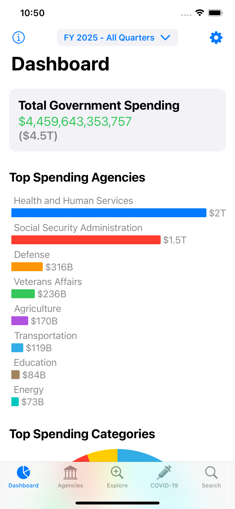
    </td>
    <td width="50%" align="center">
      <b>See top spending categories</b><br>
      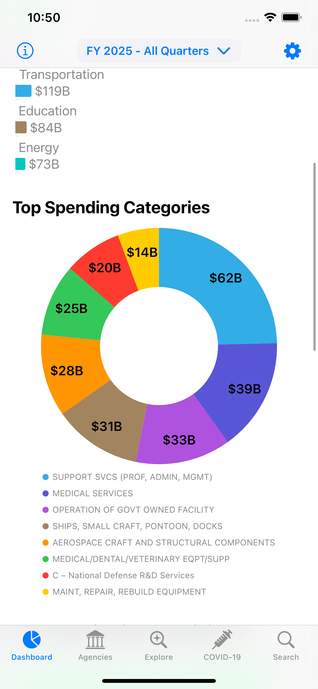
    </td>
  </tr>
  <tr>
    <td width="50%" align="center">
      <b>See top recipients of government funding</b><br>
      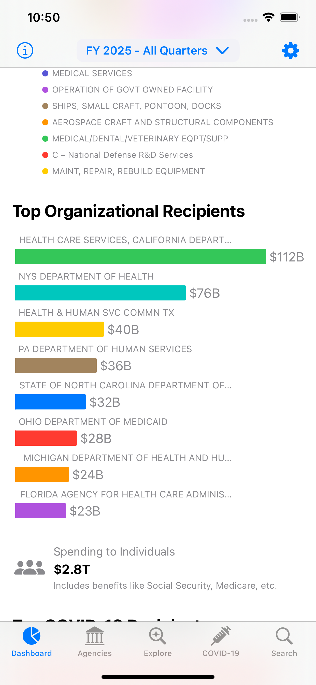
    </td>
    <td width="50%" align="center">
      <b>See top Covid-19 funding recipients</b><br>
      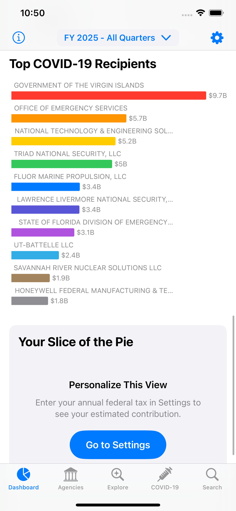
    </td>
  </tr>
  <tr>
    <td width="50%" align="center">
      <b>Choose a fiscal year (an optionally one or more fiscal quarters)</b><br>
      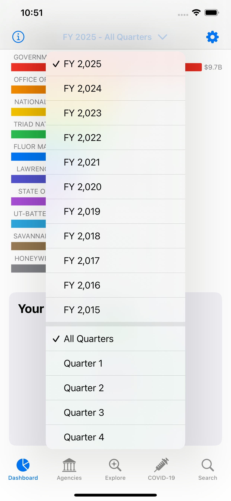
    </td>
    <td width="50%" align="center">
      <b>Drill down into a specific government agency</b><br>
      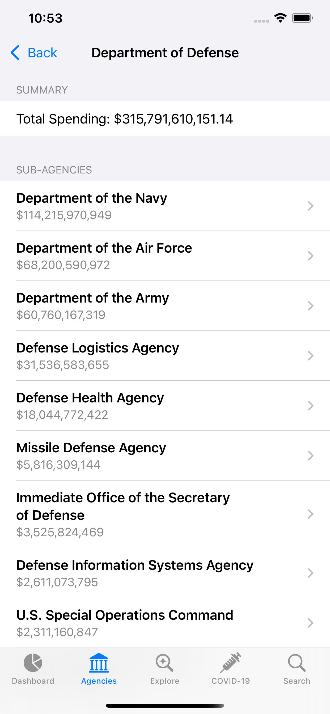
    </td>
  </tr>
  <tr>
    <td width="50%" align="center">
      <b>Or into a specific sub-agency</b><br>
      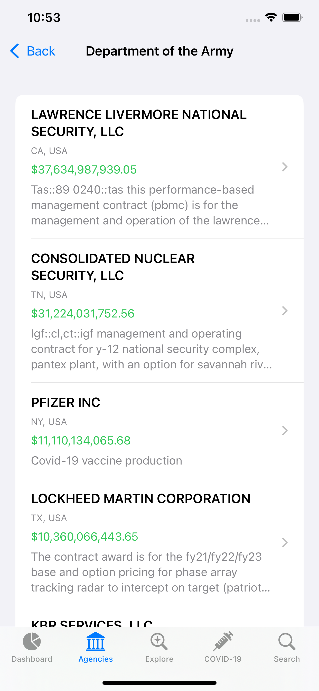
    </td>
    <td width="50%" align="center">
      <b>See details of a specific funding award</b><br>
      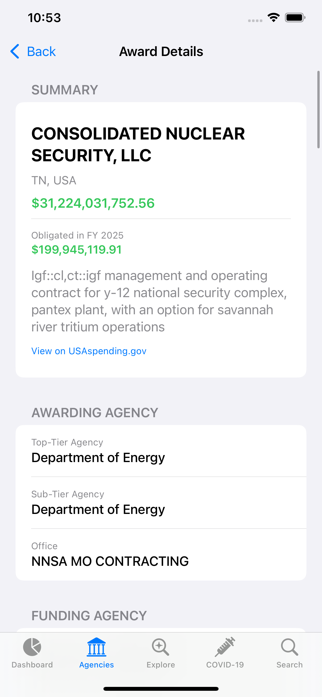
    </td>
  </tr>
  
  <tr>
    <td width="50%" align="center">
      <b>See details of various sub-awards of an award</b><br>
      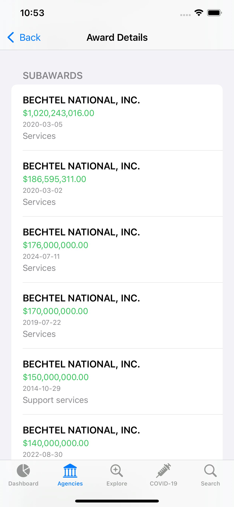
    </td>
    <td width="50%" align="center">
      <b>Explore funding by Category, State, Industry, Recipient or Federal Account</b><br>
      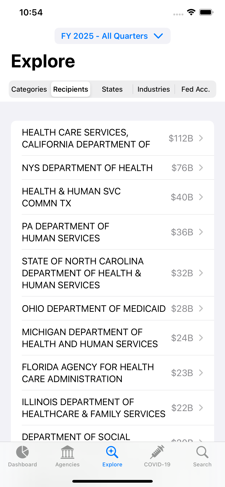
    </td>
  </tr>
  
  <tr>
    <td width="50%" align="center">
      <b>Explore Covid-19 funding awards by category</b><br>
      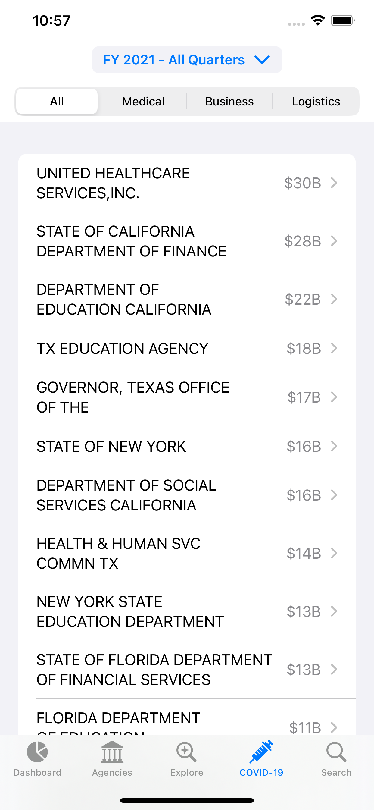
    </td>
    <td width="50%" align="center">
      <b>Search by any keyword!</b><br>
      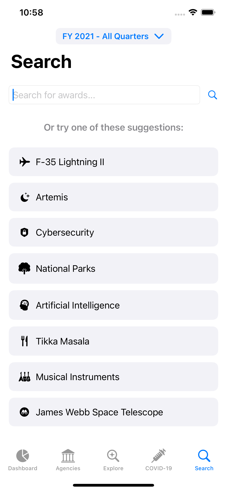
    </td>
  </tr>

</table>


## Features

-   **Interactive Dashboard**: Get a stunning, at-a-glance overview of government spending with beautiful charts and visualizations. See top-spending agencies, categories, and recipients for any fiscal year.
-   **Explore by Agency**: Dive deep into the spending of every federal agency. Navigate from top-tier departments down to sub-agencies and view detailed award information.
-   **Multi-Dimensional Exploration**: Slice and dice the data your way. Explore spending by:
    -   **Product and Service Categories (PSC)**
    -   **Recipients** (Companies and organizations)
    -   **States**
    -   **Industries (NAICS)**
    -   **Federal Accounts**
-   **COVID-19 Spending**: A dedicated section to track and understand spending related to the COVID-19 pandemic.
-   **Powerful Search**: Instantly search for specific awards and contracts using keywords.
-   **Your Slice of the Pie**: Get a personalized estimate of your contribution to government spending based on your annual tax input.

## Data Source

All data in GovSpendr is sourced directly from the **USASpending.gov API**, the official data source for U.S. government spending. Our `APIService.swift` class handles all network requests to this API, ensuring that the data you see is accurate, up-to-date, and reliable.

## App Architecture

GovSpendr is built using a modern and robust architecture, following the **Model-View-ViewModel (MVVM)** design pattern. This ensures a clean separation of concerns, making the codebase scalable, maintainable, and easy to understand.

-   **Model**: The data layer of the application. These simple Swift structs are designed to be easily decodable from the JSON responses provided by the USASpending.gov API. You'll find these in the `Models` directory.
-   **View**: The UI layer of the app, built entirely with **SwiftUI**. The views are designed to be reusable and reactive, providing a seamless user experience. All views are located in the `Views` directory.
-   **ViewModel**: The bridge between the Model and the View. ViewModels are responsible for fetching data from the API, applying business logic, and preparing it for presentation in the UI. You can find these in the `ViewModels` directory.

## Project Structure

The project is organized into a clear and logical folder structure to make navigation and development as easy as possible.

```
GovSpendr/
├── Models/           # Data models (structs) that mirror the API responses
├── Views/            # SwiftUI views, organized by feature
│   ├── Dashboard/
│   ├── Agencies/
│   ├── Explore/
│   ├── Covid/
│   ├── Search/
│   └── Shared/       # Reusable views used across the app
├── ViewModels/       # Classes that contain the business logic for each view
├── Services/         # Networking layer (APIService.swift)
├── Utilities/        # Helper files and extensions
└── GovSpendrApp.swift # The main entry point of the app
```

## Getting Started

To build and run this project, you'll need Xcode 15 or later. Clone the repository, open `GovSpendr.xcodeproj`, and run the app on the simulator or your device. No API keys are required to use the USASpending.gov API.

## License

MIT license (see `LICENSE` file at the root of the repo)

---

We hope you're as excited about bringing transparency to government spending as we are. Dive into the code, explore the data, and see what you can discover!

---

> ### **A Note on How This App Was Built**
>
> A significant portion of the code in this repository was generated with the assistance of a large language model (LLM). This project was largely **"vibe-coded,"** meaning it was developed through a rapid, iterative, and conversational process with a GenAI tool with minimal review of the generated code. Correctness of the code was checked at certain core places (e.g., using the correct API endpoints, etc). Overall app correctness check was done via manual testing of various UI workflows.

---
